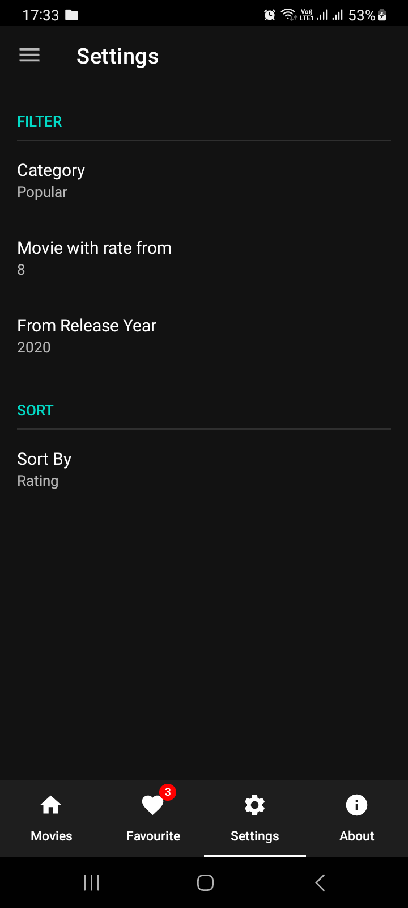

<h1 align="center">MyMovieApp</h1>

<p align="center">
MyMovieApp is a sample Android project using <a href="https://www.themoviedb.org/">The Movie DB</a> API based on MVVM architecture. It showcases the latest Android tech stacks with well-designed architecture and best practices.



</p>

## Features
* 100% Java
* MVVM architecture
* Reactive pattern
* Android Architecture Components and Jetpack Library.
* Single activity pattern
* Dependency injection


## Tech Stacks
* [Retrofit](http://square.github.io/retrofit/) + [OkHttp](http://square.github.io/okhttp/) - RESTful API and networking client.
* [Dagger](https://github.com/google/dagger) - Dependency injection.
* [Android Architecture Components](https://developer.android.com/topic/libraries/architecture) - A collections of libraries that help you design robust, testable and maintainable apps.
    * [Room](https://developer.android.com/training/data-storage/room) - Local persistence database.
    * [Paging 3](https://developer.android.com/topic/libraries/architecture/paging/v3-overview) - Pagination loading for RecyclerView.
    * [ViewModel](https://developer.android.com/reference/androidx/lifecycle/ViewModel) - UI related data holder, lifecycle aware.
    * [LiveData](https://developer.android.com/topic/libraries/architecture/livedata) - Observable data holder that notify views when underlying data changes.
    * [Data Binding](https://developer.android.com/topic/libraries/data-binding) - Declarative way to bind data to UI layout.
    * [Navigation component](https://developer.android.com/guide/navigation) - Fragment routing handler. (Upcoming)
    * [WorkManager](https://developer.android.com/topic/libraries/architecture/workmanager) - Tasks scheduler in background jobs. (Upcoming)
* [RxJava](https://github.com/ReactiveX/RxJava) - Asynchronous programming with observable streams.
* [Glide](https://github.com/bumptech/glide) - Image loading.
* [Firebase](https://firebase.google.com/) - Backend services and storage for mobile apps.

## Architectures


I follow Google recommended [Guide to app architecture](https://developer.android.com/jetpack/guide) to structure our architecture based on MVVM, reactive UI using LiveData / RxJava observables and data binding.

* **View**: Activity/Fragment with UI-specific logics only.
* **ViewModel**: It keeps the logic away from View layer, provides data streams for UI and handle user interactions.
* **Model**: Repository pattern, data layers that provide interface to manipulate data from both the local and remote data sources. The local data sources will serve as [single source of truth](https://en.wikipedia.org/wiki/Single_source_of_truth).

## Package Structures

```
Data Module:
com.example.data
├── mapper
├── repository
└── source
    ├── local
    │   ├── dao
    │   └── entity
    └── remote
        ├── model
        ├── paging
        └── service
```

```
Domain Module:
com.example.domain
├── model
├── repository
├── usecase
│  └── base
└── utils
```

```
Presentation Module:
com.example.mymovieapp
├── di
├── listener
├── ui
│   ├── about
│   ├── adapters
│   ├── base
│   ├── favorites
│   ├── main
│   ├── movies
│   │   ├── details
│   │   └── list
│   ├── profile
│   ├── reminder
│   ├── settings
│   └── MainActivity
├── utils
└── workers
```

## LICENSE

```
Copyright (c) 2020 Engine Bai

Permission is hereby granted, free of charge, to any person obtaining a copy
of this software and associated documentation files (the "Software"), to deal
in the Software without restriction, including without limitation the rights
to use, copy, modify, merge, publish, distribute, sublicense, and/or sell
copies of the Software, and to permit persons to whom the Software is
furnished to do so, subject to the following conditions:

The above copyright notice and this permission notice shall be included in all
copies or substantial portions of the Software.

THE SOFTWARE IS PROVIDED "AS IS", WITHOUT WARRANTY OF ANY KIND, EXPRESS OR
IMPLIED, INCLUDING BUT NOT LIMITED TO THE WARRANTIES OF MERCHANTABILITY,
FITNESS FOR A PARTICULAR PURPOSE AND NONINFRINGEMENT. IN NO EVENT SHALL THE
AUTHORS OR COPYRIGHT HOLDERS BE LIABLE FOR ANY CLAIM, DAMAGES OR OTHER
LIABILITY, WHETHER IN AN ACTION OF CONTRACT, TORT OR OTHERWISE, ARISING FROM,
OUT OF OR IN CONNECTION WITH THE SOFTWARE OR THE USE OR OTHER DEALINGS IN THE
SOFTWARE.
```

